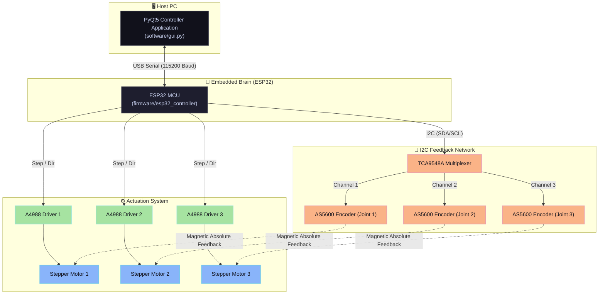

# Closed-Loop Delta Robot with ESP32 & PyQt5 GUI

[](https://www.espressif.com/en/products/socs/esp32)
[](https://www.python.org/)
[](LICENSE)

A state-of-the-art, high-speed closed-loop Delta Robot system powered by an **ESP32 microcontroller** and controlled in real-time via a custom **PyQt5 Desktop GUI**. 

This system integrates real-time forward and inverse kinematics, high-frequency PID trajectory tracking, magnetic rotary encoders (`AS5600`) multiplexed via an I2C switch (`TCA9548A`), and precision stepper motors to execute smooth circular, vertical, or point-to-point pick-and-place paths.

---

## 📸 System Overview



---

## ✨ Features

- **🚀 Real-Time Desktop Control**: Clean desktop app built with **PyQt5** to fine-tune PID values ($K_p$, $K_i$, $K_d$) and change trajectory shapes on the fly over serial.
- **🔄 Closed-Loop Feedback**: Uses three absolute **AS5600 12-bit magnetic encoders** ($4096$ ticks per revolution) mapped through a **TCA9548A I2C Multiplexer** for precise angular positioning of the main arms.
- **📐 Mathematical Modeling**: Complete embedded C++ implementation of:
  - **Inverse Kinematics (IK)**: Map $(x,y,z)$ coordinates to three joint angles $(\theta_1, \theta_2, \theta_3)$ in microseconds.
  - **Forward Kinematics (FPK)**: Re-calculate the actual position of the end-effector from joint feedback to verify accuracy.
- **📈 Advanced Trajectory Modes**:
  - `CIRCULAR`: Smooth circular trajectory on the XY plane with configurable radius and frequency.
  - `UPDOWN`: Sinusoidal vertical Z-axis movement.
  - `POINT`: Precision point-to-point pick-and-place.

---

## 📂 Repository Structure

The project has been cleaned and structured to meet professional engineering repository standards:

```
Delta_robot_project/
├── .gitignore                      # Excludes temporary IDE & build compilation artifacts
├── LICENSE                         # MIT License
├── README.md                       # High-quality documentation
├── docs/                           # Math manuals and technical publications
│   └── inverse_kinematics_fr.pdf   # Theoretical Inverse Kinematics document (French)
├── firmware/                       # Embedded firmware running on the ESP32
│   └── esp32_controller/           # Main sketch directory (compilable in Arduino IDE)
│       └── esp32_controller.ino    
├── hardware/                       # CAD and electronic hardware assets
│   ├── 3d_models/                  # 3D printable STL mechanical assemblies
│   │   ├── fixed_base.stl          # Base structural frame
│   │   ├── moving_platform.stl     # Movable end-effector platform
│   │   ├── upper_arm.stl           # Active linkage upper arm
│   │   ├── lower_arm.stl           # Passive parallel lower rod linkage
│   │   ├── spherical_joint.stl     # Custom ball-and-socket links
│   │   └── ...                     # Additional structural and motor coupling parts
│   └── datasheets/                 # Complete PDF specifications for components
│       ├── AS5600_encoder_datasheet.pdf
│       ├── stepper_motor_specs.pdf
│       └── images/                 # Hardware diagrams & reference pictures
└── software/                       # Python Desktop GUI dashboard
    ├── gui.py                      # Main control software
    └── requirements.txt            # Python environment packages listing
```

---

## 🔌 Wiring & Electrical Pinout

Since the three **AS5600 encoders** share the same hardware I2C address (`0x36`), the **TCA9548A Multiplexer** is required to route communication selectively.

### 1. I2C Network Connections
| ESP32 Pin | TCA9548A Pin | Device / Sub-Channel | Notes |
| :---: | :---: | :--- | :--- |
| **GPIO 21 (SDA)** | `SDA` | ESP32 I2C Data line | Pull-up resistor recommended |
| **GPIO 22 (SCL)** | `SCL` | ESP32 I2C Clock line | Pull-up resistor recommended |
| — | `SD0` / `SC0` | **AS5600 Encoder 1** | Joint 1 position sensor |
| — | `SD1` / `SC1` | **AS5600 Encoder 2** | Joint 2 position sensor |
| — | `SD2` / `SC2` | **AS5600 Encoder 3** | Joint 3 position sensor |

### 2. Motor Driver Connections
| Joint Axis | Driver Pin | ESP32 GPIO Pin | Function |
| :---: | :---: | :---: | :--- |
| **Joint 1** | `STEP_PIN_1` | **GPIO 18** | Step pulses for Joint 1 driver |
| **Joint 1** | `DIR_PIN_1` | **GPIO 19** | Rotation direction for Joint 1 |
| **Joint 2** | `STEP_PIN_2` | **GPIO 13** | Step pulses for Joint 2 driver |
| **Joint 2** | `DIR_PIN_2` | **GPIO 27** | Rotation direction for Joint 2 |
| **Joint 3** | `STEP_PIN_3` | **GPIO 26** | Step pulses for Joint 3 driver |
| **Joint 3** | `DIR_PIN_3` | **GPIO 25** | Rotation direction for Joint 3 |

---

## 📐 Kinematic Formats & Mathematics

A delta robot consists of a fixed base (radius $s_b$) and a moving platform (radius $s_p$) connected by three articulated parallel link mechanisms. Each mechanism consists of an active upper arm (length $L$) and a passive parallel lower arm (length $l$).

### 1. Geometric Parameters
The variables implemented inside `esp32_controller.ino` represent:
- $L = 0.150\text{ m}$ (Length of the upper arm)
- $l = 0.300\text{ m}$ (Length of the parallel lower arm)
- $s_b = 0.41268\text{ m}$ (Base equilateral triangle width)
- $s_p = 0.086\text{ m}$ (End-effector platform width)

### 2. Inverse Kinematics (IK)
Given a desired position $P(x, y, z)$ of the moving platform, the goal is to calculate the motor angles $\theta_i$ for $i \in \{1, 2, 3\}$.
For each arm, the equation of constraint is represented as:

$$E_i \cos(\theta_i) + F_i \sin(\theta_i) = G_i$$

Where:
- $E_i$ and $F_i$ are geometric parameters dependent on base coordinates, arm direction, and the platform coordinates $x$, $y$, and $z$.
- The system solves for $\theta_i$ analytically using the half-tangent substitution ($t_i = \tan(\theta_i / 2)$):

$$\theta_i = 2 \arctan\left(\frac{-F_i \pm \sqrt{E_i^2 + F_i^2 - G_i^2}}{G_i - E_i}\right)$$

---

## 🚀 Installation & Getting Started

### Prerequisites

1. **Python 3.8+**: Ensure you have Python installed. You can check using:
   ```bash
   python --version
   ```
2. **Arduino IDE**: Install the desktop software, or use **VS Code** with the **PlatformIO** extension.

### Setup Instructions

#### Step 1: Install Python Dependencies
Open your terminal inside the `software/` directory and install the necessary libraries:
```bash
pip install -r software/requirements.txt
```

#### Step 2: Upload Firmware to ESP32
1. Open `firmware/esp32_controller/esp32_controller.ino` in your Arduino IDE.
2. Install the necessary libraries in Arduino IDE via **Library Manager**:
   - `AccelStepper`
   - `PID_v1`
3. Connect your ESP32 board to your PC via a USB cable.
4. Select the appropriate **Port** and board (**ESP32 Dev Module**) in the tools menu.
5. Compile and **Upload** the sketch.

#### Step 3: Run the Desktop GUI
Start the control program using Python:
```bash
python software/gui.py
```
1. Enter your serial COM port (e.g. `COM3` on Windows, or `/dev/ttyUSB0` on Linux/macOS).
2. Tweak your desired parameters ($K_p$, $K_i$, $K_d$, Radius, Update intervals).
3. Click **Send Parameters** to immediately sync the parameters with the hardware.

---

## 📡 Serial Protocol Interface

Communication from the PyQt5 desktop GUI to the ESP32 is based on a clean semicolon-separated string format over $115200\text{ Baud}$:

```text
Kp=40.0;Ki=0.0;Kd=0.125;R=0.200;F=0.500;U=5
```

### Protocol Fields:
- `Kp`: Proportional Gain factor.
- `Ki`: Integral Gain factor.
- `Kd`: Derivative Gain factor.
- `R`: Radius of trajectory (for circular motions).
- `F`: Trajectory frequency (cycles per second).
- `U`: ESP32 control loop update interval in milliseconds.

The ESP32 processes this stream in real-time, adjusts the active PID tuning parameters on-the-fly, and replies with coordinate telemetries:

```text
Q:<setpoint_theta_1>,<setpoint_theta_2>,<setpoint_theta_3>,<measured_theta_1>,<measured_theta_2>,<measured_theta_3>,<target_x>,<target_y>,<target_z>,<calculated_x>,<calculated_y>,<calculated_z>
```

---

## 📜 License

This project is open-source software licensed under the [MIT License](LICENSE). Feel free to use, modify, and distribute it for academic or commercial applications.
